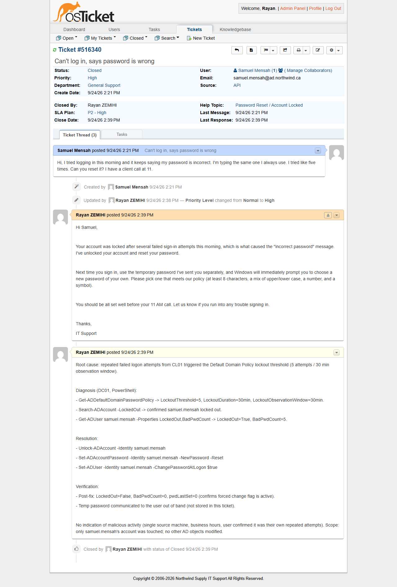

# TKT-001 — Account locked out, misleading "wrong password" error

| Field | Value |
|---|---|
| Category | Accounts and Authentication |
| Help topic | Password Reset / Account Locked |
| Department | General Support |
| Priority / SLA | High — P2 (8h, business hours) |
| Affected user / system | Samuel Mensah (Sales), logging on from CL01 |
| Resolved by | Tier 1 |

## Symptom

> Hi, I tried logging in this morning and it keeps saying my password is incorrect. I'm
> typing the same one I always use. I tried like five times. Can you reset it? I have a
> client call at 11.

The user was confident the password was correct — the "incorrect password" message was
actually an account lockout, not a bad credential. This is a common source of confusion:
Windows shows the same generic error for both cases.

## Diagnosis

1. **Check:** `Get-ADDefaultDomainPasswordPolicy` on DC01 — **Why:** confirm the lockout
   threshold before assuming lockout is the cause — **Result:** `LockoutThreshold=5`,
   `LockoutDuration=30min`, `LockoutObservationWindow=30min`.
2. **Check:** `Search-ADAccount -LockedOut` on DC01 — **Why:** get an authoritative list of
   currently locked accounts rather than trusting the user's description — **Result:**
   `samuel.mensah` listed as locked out.
3. **Check:** `Get-ADUser samuel.mensah -Properties LockedOut,BadPwdCount` — **Why:**
   confirm the specific account state and attempt count — **Result:** `LockedOut=True`,
   `BadPwdCount=5`, matching the user's "tried like five times."

```powershell
Import-Module ActiveDirectory
Get-ADDefaultDomainPasswordPolicy | Select-Object LockoutThreshold, LockoutDuration, LockoutObservationWindow

# LockoutThreshold         : 5
# LockoutDuration          : 00:30:00
# LockoutObservationWindow : 00:30:00

Search-ADAccount -LockedOut | Select-Object Name, SamAccountName, LockedOut

# Name           : Samuel Mensah
# SamAccountName : samuel.mensah
# LockedOut      : True

Get-ADUser samuel.mensah -Properties LockedOut, BadPwdCount | Select-Object Name, LockedOut, BadPwdCount

# Name        : Samuel Mensah
# LockedOut   : True
# BadPwdCount : 5
```

No indication of malicious activity: the failed attempts all came from the user's own
workstation (CL01) during business hours, and the user confirmed the repeated attempts
were their own.

## Resolution

On DC01, using the Active Directory PowerShell module:

1. `Unlock-ADAccount -Identity samuel.mensah`
2. `Set-ADAccountPassword -Identity samuel.mensah -NewPassword <temp> -Reset` — a random
   temporary password generated at the point of use and never written to a script, log, or
   this ticket.
3. `Set-ADUser -Identity samuel.mensah -ChangePasswordAtLogon $true` — forces the user to
   set their own password on next logon rather than continuing to use a temp value known to
   IT.

Equivalent GUI path: *Active Directory Users and Computers > NORTHWIND > Users > Sales >
Samuel Mensah > right-click > Unlock Account*, then *Reset Password* with "User must
change password at next logon" checked.

## Root cause

Five consecutive failed logon attempts from CL01 tripped the Default Domain Policy's
account lockout threshold (5 attempts / 30-minute observation window). The account itself
was never compromised — the error message Windows shows for a locked account is
indistinguishable from a genuinely wrong password, which is why the user assumed the
latter.

## Verification

Post-fix account state, queried on DC01:

```powershell
Get-ADUser samuel.mensah -Properties LockedOut, BadPwdCount, pwdLastSet, PasswordExpired |
    Select-Object Name, LockedOut, BadPwdCount, pwdLastSet, PasswordExpired

# Name            : Samuel Mensah
# LockedOut       : False
# BadPwdCount     : 0
# pwdLastSet      : 0
# PasswordExpired : True
```

`LockedOut=False` and `BadPwdCount=0` confirm the unlock and reset took effect.
`pwdLastSet=0` is Active Directory's standard marker for "must change password at next
logon" — confirming the forced-change flag is active without requiring an interactive
logon test on CL01. The temporary password was communicated to the user out of band, not
through the ticket.

## Prevention

None needed for this specific event — a one-off mistyped-password lockout is normal
helpdesk volume, not a symptom of a system problem. If the same account locks out
repeatedly without a corresponding user-confirmed cause, treat it like TKT-007 (stale
cached credential) instead of repeating a plain unlock.

## Screenshots



No console capture of the lockout: the fault was injected with a scripted credential-validation loop, not an interactive CL01 logon, so no lockout dialog ever appeared on screen.
