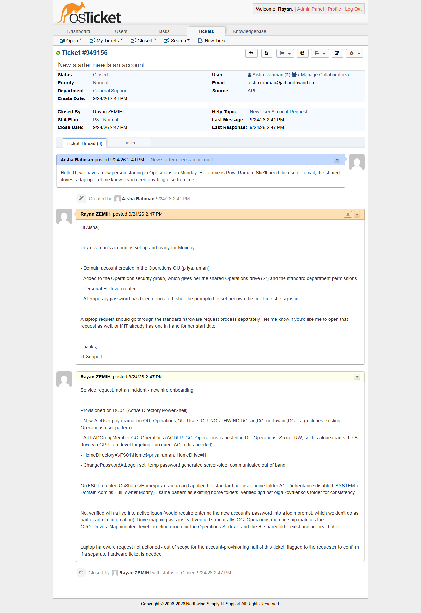

# TKT-002 — New starter needs an account

| Field | Value |
|---|---|
| Category | Accounts and Authentication (service request, not an incident) |
| Help topic | New User Account Request |
| Department | General Support |
| Priority / SLA | Normal — P3 (24h, business hours) |
| Affected user / system | New hire: Priya Raman (Operations); requested by Aisha Rahman (HR) |
| Resolved by | Tier 1 |

## Symptom

> Hello IT, we have a new person starting in Operations on Monday. Her name is Priya
> Raman. She'll need the usual — email, the shared drives, a laptop. Let me know if you
> need anything else from me.

This is a **service request**, not an incident: nothing is broken, a new resource needs
to be provisioned ahead of a start date. The distinction matters for how it is triaged,
prioritized and documented — there is no "fault" to diagnose, only a checklist to execute
correctly and completely.

## Diagnosis

Not applicable in the incident-response sense. The only "check" performed was against an
existing Operations account (`olga.kovalenko`) to confirm the correct OU path, group, and
home-directory convention before creating the new one — so the new account matches
existing provisioning exactly rather than improvising a one-off structure.

## Resolution

On DC01 (Active Directory PowerShell):

```powershell
New-ADUser -Name "Priya Raman" -GivenName "Priya" -Surname "Raman" `
    -SamAccountName "priya.raman" -UserPrincipalName "priya.raman@ad.northwind.ca" `
    -Path "OU=Operations,OU=Users,OU=NORTHWIND,DC=ad,DC=northwind,DC=ca" `
    -Department "Operations" `
    -HomeDirectory "\\FS01\Home$\priya.raman" -HomeDrive "H:" `
    -AccountPassword <temp, generated at use, not logged> -Enabled $true -ChangePasswordAtLogon $true

Add-ADGroupMember -Identity "GG_Operations" -Members "priya.raman"
```

Following the AGDLP model already in place, adding the account to `GG_Operations` is
sufficient to grant the shared Operations drive — `GG_Operations` is nested inside
`DL_Operations_Share_RW`, so no direct ACL edit was needed.

On FS01, the personal home folder was created and locked down with the same pattern used
for every other home folder:

```powershell
$path = "C:\Shares\Home\priya.raman"
New-Item -Path $path -ItemType Directory -Force
icacls $path /inheritance:d
icacls $path /remove "BUILTIN\Users"
icacls $path /grant "SYSTEM:(OI)(CI)F"
icacls $path /grant "NORTHWIND\Domain Admins:(OI)(CI)F"
icacls $path /grant "NORTHWIND\priya.raman:(OI)(CI)M"
```

GUI equivalent: *Active Directory Users and Computers > NORTHWIND > Users > Operations >
New > User*, then add to the `GG_Operations` group from the *Member Of* tab.

The laptop hardware request was **not** actioned as part of this ticket — provisioning an
account and provisioning hardware are different workflows, and bundling them silently
would hide the hardware request from whatever process tracks it. The reply asks HR to
confirm whether a separate hardware ticket already exists.

## Root cause

N/A — planned onboarding, not a fault.

## Verification

Not verified with a live interactive logon: that would mean entering the new account's
password into a Windows logon prompt, which falls under the same restriction as any other
credential entry and isn't something this automation does. Verification was structural
instead:

- `Get-ADUser priya.raman -Properties MemberOf` confirms membership in `GG_Operations`,
  which matches the security-group condition on the `GPO_Drives_Mapping` GPP item for the
  Operations `S:` drive (already validated end-to-end for this GPO in Project 1).
- The `H:` target (`\\FS01\Home$\priya.raman`) exists on FS01 and its ACL matches the
  pattern used by every other home folder, confirmed against `olga.kovalenko`'s folder
  side by side.

## Prevention

N/A.

## Screenshots


