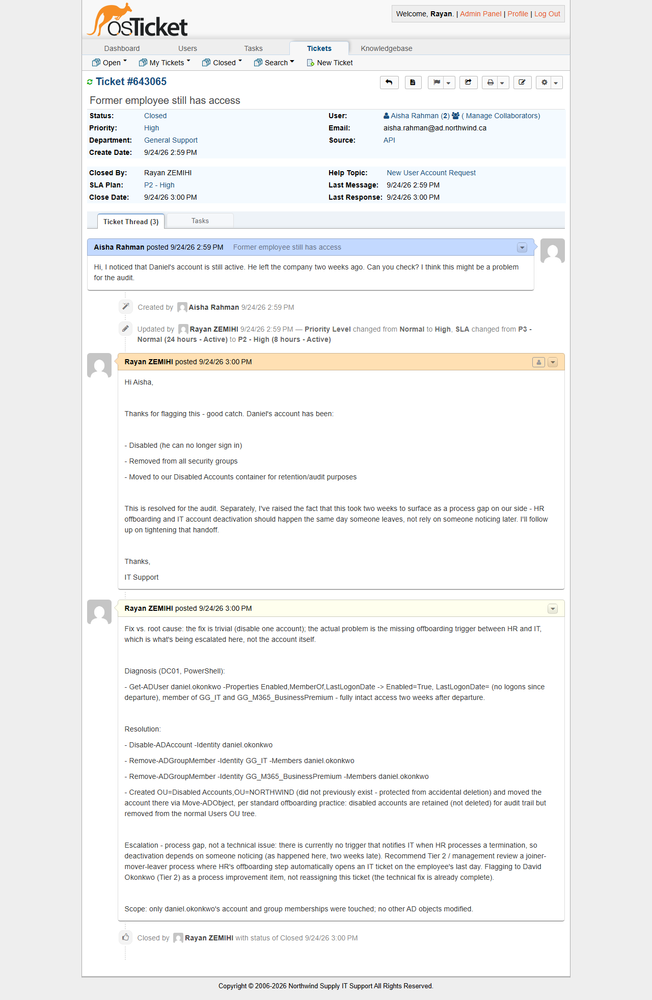

# TKT-004 — Former employee still has access

| Field | Value |
|---|---|
| Category | Accounts and Authentication |
| Help topic | New User Account Request (catalog routing; ticket is actually an offboarding/audit issue) |
| Department | General Support |
| Priority / SLA | High — P2 (8h, business hours) — corrected from the topic's default Normal/P3 |
| Affected user / system | Daniel Okonkwo (IT) — departed employee; reported by Aisha Rahman (HR) |
| Resolved by | Tier 1 (technical fix) + process gap flagged for Tier 2 |

## Symptom

> Hi, I noticed that Daniel's account is still active. He left the company two weeks ago.
> Can you check? I think this might be a problem for the audit.

An account audit finding, not a technical fault: the account works exactly as designed,
it just should have been deactivated two weeks earlier.

## Diagnosis

1. **Check:** `Get-ADUser daniel.okonkwo -Properties Enabled, MemberOf, LastLogonDate` —
   **Why:** confirm the account is genuinely still enabled with intact access rather than
   relying on the reporter's description — **Result:** `Enabled=True`, `LastLogonDate`
   blank (no logons since he left, consistent with the report), still a member of
   `GG_IT` and `GG_M365_BusinessPremium`.

```powershell
Import-Module ActiveDirectory
Get-ADUser daniel.okonkwo -Properties Enabled, MemberOf, LastLogonDate |
    Select-Object Name, Enabled, LastLogonDate

# Name    : Daniel Okonkwo
# Enabled : True
# LastLogonDate :
```

## Resolution

```powershell
Disable-ADAccount -Identity daniel.okonkwo
Remove-ADGroupMember -Identity "GG_IT" -Members daniel.okonkwo -Confirm:$false
Remove-ADGroupMember -Identity "GG_M365_BusinessPremium" -Members daniel.okonkwo -Confirm:$false

# Retain (don't delete) disabled accounts for audit history, out of the normal Users tree:
New-ADOrganizationalUnit -Name "Disabled Accounts" `
    -Path "OU=NORTHWIND,DC=ad,DC=northwind,DC=ca" -ProtectedFromAccidentalDeletion $true
Move-ADObject -Identity (Get-ADUser daniel.okonkwo).DistinguishedName `
    -TargetPath "OU=Disabled Accounts,OU=NORTHWIND,DC=ad,DC=northwind,DC=ca"
```

GUI equivalent: *Active Directory Users and Computers > NORTHWIND > Users > IT > Daniel
Okonkwo > Disable Account*, then remove group memberships from the *Member Of* tab, then
drag/move the object into a new *Disabled Accounts* OU under *NORTHWIND*.

**The fix and the root cause are two different things here.** Disabling one account takes
thirty seconds. The actual problem — flagged separately, not solved by this ticket — is
that nothing currently notifies IT when HR processes a termination, so deactivation
depends on someone happening to notice, as happened here two weeks late. That gap was
documented in the internal note as a process item for Tier 2 review (a joiner-mover-leaver
process where HR's offboarding step automatically opens an IT ticket), rather than solved
inline, since changing the offboarding process is outside what a single ticket — or a
Tier 1 technician acting alone — should decide.

## Root cause

No automated handoff exists between HR offboarding and IT account deactivation. The
individual account being left enabled is a symptom of that missing process, not an
isolated mistake.

## Verification

```powershell
Get-ADUser daniel.okonkwo -Properties Enabled, MemberOf, DistinguishedName |
    Select-Object Name, Enabled, MemberOf, DistinguishedName

# Enabled : False
# MemberOf : {}
# DistinguishedName : CN=Daniel Okonkwo,OU=Disabled Accounts,OU=NORTHWIND,DC=ad,DC=northwind,DC=ca
```

Account is disabled, holds no group memberships, and sits in the Disabled Accounts OU —
confirms both that access is fully revoked and that the object is preserved for audit
rather than deleted.

## Prevention

Escalated as a process item rather than fixed here: HR's termination step should trigger
an IT ticket (or a direct account-deactivation workflow) on the employee's actual last
day, not rely on a downstream audit catching it weeks later. Worth pairing with a periodic
stale-account report (e.g. accounts enabled with no logon in N days) as a safety net for
cases the trigger misses.

## Screenshots


