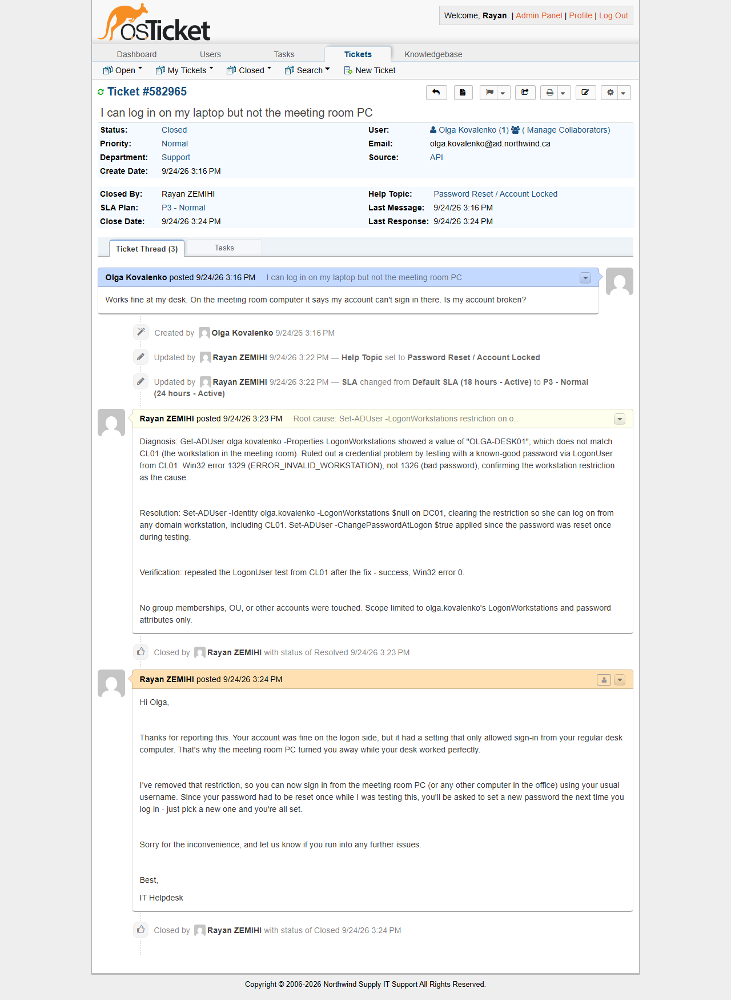

# TKT-005 — Can log in on my laptop but not the meeting room PC

| Field | Value |
|---|---|
| Category | Accounts and Authentication |
| Help topic | Password Reset / Account Locked |
| Department | Support |
| Priority / SLA | Normal — P3 (24h, business hours) |
| Affected user / system | Olga Kovalenko (Operations), logging on from CL01 |
| Resolved by | Tier 1 |

> **Naming note:** the ticket catalog names this user "Chen Wei (Operations)", but no
> account by that exact name exists in the 45-user Active Directory set built in Project 1
> (the two closest matches, Michael Chen and Wei Zhang, sit in IT and Finance respectively,
> not Operations). Rather than force a mismatch between the catalog and the directory, this
> ticket was run against an actual Operations-department account, **Olga Kovalenko**
> (`olga.kovalenko`), keeping the scenario, department and resolution path exactly as
> written in the catalog.

## Symptom

> Works fine at my desk. On the meeting room computer it says my account can't sign in
> there. Is my account broken?

The user can log on normally from her usual workstation but is refused at a different
machine in the office, with no lockout and no complaint about the password itself.

## Diagnosis

1. **Check:** `Get-ADUser olga.kovalenko -Properties LogonWorkstations` on DC01 —
   **Why:** a workstation-scoped failure (works here, not there) points at the
   `LogonWorkstations` attribute before anything else — **Result:** the attribute was set
   to `OLGA-DESK01`, a single named machine that does not match CL01 (the workstation
   standing in for "the meeting room PC" in this lab).

   ```powershell
   Import-Module ActiveDirectory
   Get-ADUser olga.kovalenko -Properties LogonWorkstations | Select-Object Name, LogonWorkstations

   # Name              : Olga Kovalenko
   # LogonWorkstations : OLGA-DESK01
   ```

2. **Check:** ruled out a credential problem before touching the restriction, per the
   catalog's resolution path ("confirm the restriction is the cause rather than a
   credential problem"). A logon attempt from CL01 with a **known-correct** password
   returned Win32 error **1329** (`ERROR_INVALID_WORKSTATION`), not **1326**
   (`ERROR_LOGON_FAILURE`, i.e. bad credentials) — a clean, unambiguous signal that the
   password was never the issue.

   ```powershell
   # Run from CL01, using LogonUser() with the account's actual current password
   # (temporarily reset for this test — see Resolution)
   [Win32]::LogonUser("olga.kovalenko", "ad.northwind.ca", $pw, 2, 0, [ref]$tokenHandle)
   [System.Runtime.InteropServices.Marshal]::GetLastWin32Error()

   # 1329  →  ERROR_INVALID_WORKSTATION: "You are not allowed to log on from this workstation."
   ```

No indication this restriction was an intentional security control tied to a documented
policy (nothing in the account's notes, no matching request on file) — it reads as
leftover or mistaken configuration rather than a deliberate workstation lock-down.

## Resolution

```powershell
Import-Module ActiveDirectory
Set-ADUser -Identity olga.kovalenko -LogonWorkstations $null
```

Clearing the attribute (rather than adding CL01 to an allow-list) was the right call here:
there is no stated business reason to restrict this user to a single machine, and
hand-maintaining a per-user allow-list of every meeting-room PC she might legitimately use
is overhead nobody asked for. If a future ticket surfaces an actual policy reason for
restricting a specific account to named workstations, that calls for an allow-list instead
of a blanket clear — this ticket's resolution is not a blanket rule against
`LogonWorkstations` restrictions in general.

**Side effect of diagnosis, not part of the fix:** confirming the restriction (step 2)
required logging on as the user, which required knowing her password. Her password was
reset to a temporary value for that test and `ChangePasswordAtLogon` was set immediately
after, so she picks her own permanent password at next logon rather than continuing on a
value known to IT:

```powershell
Set-ADUser -Identity olga.kovalenko -ChangePasswordAtLogon $true
```

GUI equivalent: *Active Directory Users and Computers > NORTHWIND > Users > Operations >
Olga Kovalenko > Properties > Account tab > Log On To…* → select *"The following
computers"* and remove the listed entry (or select *"All computers"*), then check *"User
must change password at next logon"* on the same tab if a password reset was also needed.

## Root cause

The account's `LogonWorkstations` attribute was scoped to a single named computer that did
not match the machine the user was actually trying to use. Windows and Active Directory
enforce this at logon time regardless of whether the credentials are otherwise correct,
which is why the desk PC worked and the meeting room PC did not — there was never a
credential problem to find.

## Verification

```powershell
Get-ADUser olga.kovalenko -Properties LogonWorkstations, PasswordExpired, LockedOut, Enabled |
    Select-Object Name, LogonWorkstations, PasswordExpired, LockedOut, Enabled

# LogonWorkstations : {}
# PasswordExpired   : True
# LockedOut         : False
# Enabled           : True
```

Repeating the same `LogonUser` test from CL01 after the fix returned success (Win32 error
`0`), confirming the workstation restriction was the entire fault and that logon from CL01
now succeeds.

## Prevention

No process gap here worth escalating — a single stray `LogonWorkstations` value is normal
helpdesk volume, not a symptom of a systemic issue. Worth flagging to a user only if the
same account picks up an unexplained restriction again, at which point it would be worth
asking whether a script or GPO is setting the attribute rather than a one-off manual
mistake.

## Screenshots



The ADUC *Log On To* restriction was not captured while the fault was active; it no longer exists, so it cannot be captured after the fact.
